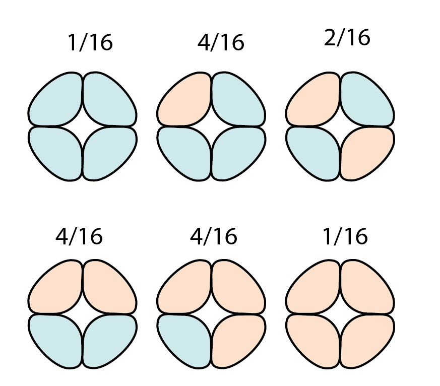

# ITPR3_analysis
In silico analyses of ITPR3 variants.
This is the support data for a [Michelanglo page](https://michelanglo.sgc.ox.ac.uk/) —page yet to be released.

## Models

Inositol 1,4,5-trisphosphate receptor type 3 ([Uniprot: Q14573](https://www.uniprot.org/uniprot/Q14573))
is a calcium channel activated by inositol 1,4,5-trisphosphate.

In [Paknejad & Hite, 2018](https://www.nature.com/articles/s41594-018-0089-6), a variety of structures were solved
by cryoEM in various states. 

|    | name                 | emd      | pdb   |  Zn   |  I3P  |  Ca   | Presumed state |
|---:|:---------------------|:---------|:------|:------|:------|:------|:---------------------|
|  0 | hIP3R3 apo           | EMD-7978 | 6DQJ  | 1     |  0    | 0     |Closed                |
|  1 | hIP3R3 IP3 class 1   | EMD-7981 | 6DQN  | 1     |  1    | 0     |Pre-activation 1:1:1:1|
|  2 | hIP3R3 IP3 class 2   | EMD-7984 | 6DQV  | 1     |  1    | 0     |Pre-activation 2:2:2:2| 
|  3 | hIP3R3 IP3 class 3   | EMD-7983 | 6DQS  | 1     |  1    | 0     |Pre-activation 2:2:2:1|
|  4 | hIP3R3 IP3 class 4   | EMD-7986 | 6DQZ  | 1     |  1    | 0     |Pre-activation 2:2:1:1|
|  5 | hIP3R3 IP3 class 5   | EMD-7987 | 6DR0  | 1     |  1    | 0     |Pre-activation 2:1:1:1|
|  6 | hIP3R3 Ca2+ bound    | EMD-7988 | 6DR2  | 1     |  0    | 2     |Inhibited             |
|  7 | hIP3R3 low IP3–Ca2+  | EMD-7991 | 6DRA  | 1     |  0    | 2     |Inhibited             | 
|  8 | hIP3R3 high IP3–Ca2+ | EMD-7994 | 6DRC  | 1     |  1    | 2     |Inhibited             |

(The class 1 and class 2 have the ARM2 domain in different positions, class 1 is similar to Apo, while 2 isn't,
all other classes are mixes of class 1 and class 2 states).

Do note that the models exceed 99,999 atoms making the PDB format problematic.
As a consequence the minimised models are present in the [folder structures](structures) as
both `pdb` and `mmtf`.

| definition    |   from |   to |
|:--------------|-------:|-----:|
| cytoplasmic   |      1 | 2202 |
| transmembrane |   2206 | 2671 |
| Ins145_P3_rec |      3 |  230 |
| MIR           |    233 |  433 |
| RYDR_ITPR     |    473 |  670 |
| RYDR_ITPR     |   1175 | 1334 |
| RIH_assoc     |   1864 | 1974 |
| Ion_trans     |   2206 | 2528 |

## Calculations

Pyrosetta was used.
Base script are in [my pyrosetta_scripts repo](https://github.com/matteoferla/pyrosetta_scripts).
Code used is in [code notes](code.md).

Each of the structures was minimised using LocalRelax mover and against the respective electron density.

In light of the absence of key membrane facing residues, the membrane framework was not used.

Given a mutation, the 12 Å neighbourhood of the wild type was energy minimised (resulting in the ∆G of the wild type),
the mutation introduced and minimised again.

A final 5 cycles of dihedral Relax per chain was initially considered by not done (5 CPU days and insufficient)
hence the 12 Å neighbourhood thorough minimisation was done for each variant.

The ref2015 scorefunction was used with a 2.94 scaling to convert REU to kcal/mol. 

|    | mutation   |   complex_ddG |   chainA_interface_ddG |   ratio_rmsd | highest_contributor   |   highest_contributor_value | highest_contributor_wordy                                                                                               | lowest_contributor   |   lowest_contributor_value | lowest_contributor_wordy                                                                                                |
|---:|:-----------|--------------:|-----------------------:|-------------:|:----------------------|----------------------------:|:------------------------------------------------------------------------------------------------------------------------|:---------------------|---------------------------:|:------------------------------------------------------------------------------------------------------------------------|
|  2 | W168A      |     -0.792876 |             1.4554     |  1.28818     | fa_atr                |                    14.1751  | Lennard-Jones attractive between atoms in different residues (r^6 term, London dispersion forces).                      | fa_sol               |                  -6.32343  | Lazaridis-Karplus solvation energy.                                                                                     |
|  5 | W168A      |      6.75095  |             5.3006     |  2.41538     | fa_atr                |                    13.6818  | Lennard-Jones attractive between atoms in different residues (r^6 term, London dispersion forces).                      | fa_sol               |                  -5.32891  | Lazaridis-Karplus solvation energy.                                                                                     |
|  8 | W168A      |     -0.49113  |             1.90465    |  0.240574    | fa_atr                |                    11.3406  | Lennard-Jones attractive between atoms in different residues (r^6 term, London dispersion forces).                      | fa_sol               |                  -5.31269  | Lazaridis-Karplus solvation energy.                                                                                     |
| 11 | W168A      |      5.30912  |             4.09899    |  1.54893     | fa_atr                |                    14.0614  | Lennard-Jones attractive between atoms in different residues (r^6 term, London dispersion forces).                      | fa_sol               |                  -6.03404  | Lazaridis-Karplus solvation energy.                                                                                     |
| 14 | W168A      |      1.39983  |             2.9214     |  4.23685     | fa_atr                |                    10.9807  | Lennard-Jones attractive between atoms in different residues (r^6 term, London dispersion forces).                      | fa_sol               |                  -4.49122  | Lazaridis-Karplus solvation energy.                                                                                     |
| 17 | W168A      |      2.54956  |             2.74197    |  1.29607     | fa_atr                |                    12.7198  | Lennard-Jones attractive between atoms in different residues (r^6 term, London dispersion forces).                      | fa_sol               |                  -6.1499   | Lazaridis-Karplus solvation energy.                                                                                     |
| 20 | W168A      |     -3.24007  |             0.0548555  |  0.306726    | fa_atr                |                     2.67366 | Lennard-Jones attractive between atoms in different residues (r^6 term, London dispersion forces).                      | fa_dun               |                  -3.85607  | Internal energy of sidechain rotamers as derived from Dunbrack's statistics (2010 Rotamer Library used in Talaris2013). |
| 23 | W168A      |     -1.03121  |             0.0276575  |  2.33758     | fa_atr                |                     4.54425 | Lennard-Jones attractive between atoms in different residues (r^6 term, London dispersion forces).                      | fa_sol               |                  -2.00088  | Lazaridis-Karplus solvation energy.                                                                                     |
| 26 | W168A      |      1.79189  |            -0.040445   |  0.544664    | fa_atr                |                    10.4284  | Lennard-Jones attractive between atoms in different residues (r^6 term, London dispersion forces).                      | fa_sol               |                  -8.26354  | Lazaridis-Karplus solvation energy.                                                                                     |
|  0 | A196T      |      0.488611 |            -0.0366094  |  0.506835    | fa_rep                |                     1.41883 | Lennard-Jones repulsive between atoms in different residues (r^12 term, Pauli repulsion forces).                        | hbond_sc             |                  -1.73418  | Sidechain-sidechain hydrogen bond energy.                                                                               |
|  3 | A196T      |      0.889734 |            -0.0161907  |  6.71916e-12 | fa_sol                |                     1.23414 | Lazaridis-Karplus solvation energy.                                                                                     | fa_atr               |                  -1.50666  | Lennard-Jones attractive between atoms in different residues (r^6 term, London dispersion forces).                      |
|  6 | A196T      |      3.82806  |            -0.0993198  |  0.314654    | fa_sol                |                     4.15249 | Lazaridis-Karplus solvation energy.                                                                                     | fa_atr               |                  -6.1963   | Lennard-Jones attractive between atoms in different residues (r^6 term, London dispersion forces).                      |
|  9 | A196T      |      0.200049 |            -0.0310064  |  0.774236    | fa_sol                |                     2.13054 | Lazaridis-Karplus solvation energy.                                                                                     | fa_atr               |                  -2.98668  | Lennard-Jones attractive between atoms in different residues (r^6 term, London dispersion forces).                      |
| 12 | A196T      |      0.789079 |             0.0565383  |  4.85283e-12 | hbond_bb_sc           |                     2.0973  | Sidechain-backbone hydrogen bond energy.                                                                                | fa_atr               |                  -1.87156  | Lennard-Jones attractive between atoms in different residues (r^6 term, London dispersion forces).                      |
| 15 | A196T      |      5.96108  |             0.00994665 |  0.855509    | fa_atr                |                     5.42037 | Lennard-Jones attractive between atoms in different residues (r^6 term, London dispersion forces).                      | fa_sol               |                  -0.693968 | Lazaridis-Karplus solvation energy.                                                                                     |
| 18 | A196T      |     17.3138   |             0.0169175  |  0.573137    | rama_prepro           |                     8.20273 | Backbone torsion preference term that takes into account of whether preceding amono acid is Proline or not.             | fa_atr               |                  -3.92033  | Lennard-Jones attractive between atoms in different residues (r^6 term, London dispersion forces).                      |
| 21 | A196T      |      8.38344  |             0.00757808 |  0.345558    | rama_prepro           |                     9.13465 | Backbone torsion preference term that takes into account of whether preceding amono acid is Proline or not.             | fa_sol               |                  -1.36654  | Lazaridis-Karplus solvation energy.                                                                                     |
| 24 | A196T      |      4.9253   |             0.329382   |  0.254968    | fa_atr                |                     4.91639 | Lennard-Jones attractive between atoms in different residues (r^6 term, London dispersion forces).                      | fa_sol               |                 -11.0044   | Lazaridis-Karplus solvation energy.                                                                                     |
|  1 | V615M      |     -1.97872  |             0.00457623 |  1.22331     | fa_rep                |                     3.06482 | Lennard-Jones repulsive between atoms in different residues (r^12 term, Pauli repulsion forces).                        | pro_close            |                 -11.6482   | Proline ring closure energy and energy of psi angle of preceding residue.                                               |
|  4 | V615M      |     12.4254   |             0.0715084  |  0.687026    | fa_atr                |                     6.00291 | Lennard-Jones attractive between atoms in different residues (r^6 term, London dispersion forces).                      | fa_sol               |                  -1.47887  | Lazaridis-Karplus solvation energy.                                                                                     |
|  7 | V615M      |      3.63919  |             0.347547   |  0.912324    | fa_dun                |                     3.81983 | Internal energy of sidechain rotamers as derived from Dunbrack's statistics (2010 Rotamer Library used in Talaris2013). | fa_atr               |                  -6.16782  | Lennard-Jones attractive between atoms in different residues (r^6 term, London dispersion forces).                      |
| 10 | V615M      |      4.84693  |            -0.125771   |  0.837861    | fa_dun                |                     3.14798 | Internal energy of sidechain rotamers as derived from Dunbrack's statistics (2010 Rotamer Library used in Talaris2013). | fa_atr               |                  -3.00756  | Lennard-Jones attractive between atoms in different residues (r^6 term, London dispersion forces).                      |
| 13 | V615M      |      3.05696  |             0.192714   |  0.406604    | fa_dun                |                     5.321   | Internal energy of sidechain rotamers as derived from Dunbrack's statistics (2010 Rotamer Library used in Talaris2013). | fa_atr               |                  -5.54926  | Lennard-Jones attractive between atoms in different residues (r^6 term, London dispersion forces).                      |
| 16 | V615M      |      0.80958  |            -0.0262003  |  0.395657    | fa_dun                |                     2.65277 | Internal energy of sidechain rotamers as derived from Dunbrack's statistics (2010 Rotamer Library used in Talaris2013). | fa_elec              |                  -3.84392  | Coulombic electrostatic potential with a distance-dependent dielectric.                                                 |
| 19 | V615M      |      4.02001  |             0.100142   |  1.64867     | fa_elec               |                     2.57703 | Coulombic electrostatic potential with a distance-dependent dielectric.                                                 | fa_atr               |                  -3.89224  | Lennard-Jones attractive between atoms in different residues (r^6 term, London dispersion forces).                      |
| 22 | V615M      |      1.37533  |             0.0113755  |  0.708441    | fa_dun                |                     2.82856 | Internal energy of sidechain rotamers as derived from Dunbrack's statistics (2010 Rotamer Library used in Talaris2013). | fa_atr               |                  -1.19799  | Lennard-Jones attractive between atoms in different residues (r^6 term, London dispersion forces).                      |
| 25 | V615M      |     17.9026   |             0.242348   |  1.78299     | fa_rep                |                    10.5393  | Lennard-Jones repulsive between atoms in different residues (r^12 term, Pauli repulsion forces).                        | fa_atr               |                  -6.49701  | Lennard-Jones attractive between atoms in different residues (r^6 term, London dispersion forces).                      |
| 27 | I2506N     |      5.03237  |           nan          |  4.27686     | fa_sol                |                     3.37273 | Lazaridis-Karplus solvation energy.                                                                                     | ref                  |                  -3.644    | Reference energy for each amino acid. Balances internal energy of amino acid terms.  Plays role in design.              |
| 28 | I2506N     |      3.2551   |           nan          |  0.785287    | fa_sol                |                     2.96581 | Lazaridis-Karplus solvation energy.                                                                                     | ref                  |                  -3.644    | Reference energy for each amino acid. Balances internal energy of amino acid terms.  Plays role in design.              |
| 29 | I2506N     |      3.83456  |           nan          |  3.22132     | fa_sol                |                     2.97989 | Lazaridis-Karplus solvation energy.                                                                                     | ref                  |                  -3.644    | Reference energy for each amino acid. Balances internal energy of amino acid terms.  Plays role in design.              |
| 30 | I2506N     |      4.2125   |           nan          |  2.58198     | fa_sol                |                     3.34811 | Lazaridis-Karplus solvation energy.                                                                                     | ref                  |                  -3.644    | Reference energy for each amino acid. Balances internal energy of amino acid terms.  Plays role in design.              |
| 31 | I2506N     |      3.53379  |           nan          |  0.855382    | fa_sol                |                     3.21007 | Lazaridis-Karplus solvation energy.                                                                                     | ref                  |                  -3.644    | Reference energy for each amino acid. Balances internal energy of amino acid terms.  Plays role in design.              |
| 32 | I2506N     |      6.10866  |           nan          |  0.525301    | fa_sol                |                     4.48853 | Lazaridis-Karplus solvation energy.                                                                                     | ref                  |                  -3.644    | Reference energy for each amino acid. Balances internal energy of amino acid terms.  Plays role in design.              |
| 33 | I2506N     |     -0.536716 |           nan          |  1.15921     | fa_atr                |                     7.30297 | Lennard-Jones attractive between atoms in different residues (r^6 term, London dispersion forces).                      | fa_rep               |                  -6.9141   | Lennard-Jones repulsive between atoms in different residues (r^12 term, Pauli repulsion forces).                        |
| 34 | I2506N     |      4.79272  |           nan          |  0.8095      | fa_sol                |                     5.147   | Lazaridis-Karplus solvation energy.                                                                                     | ref                  |                  -3.644    | Reference energy for each amino acid. Balances internal energy of amino acid terms.  Plays role in design.              |
| 35 | I2506N     |      3.88636  |           nan          |  1.1188      | fa_dun                |                     1.73764 | Internal energy of sidechain rotamers as derived from Dunbrack's statistics (2010 Rotamer Library used in Talaris2013). | ref                  |                  -3.644    | Reference energy for each amino acid. Balances internal energy of amino acid terms.  Plays role in design.              |
|  9 | R2524C     |      6.78917  |           nan          |  1.89251     | fa_elec               |                     6.11104 | Coulombic electrostatic potential with a distance-dependent dielectric.                                                 | fa_sol               |                  -9.66374  | Lazaridis-Karplus solvation energy.                                                                                     |
| 10 | R2524C     |      5.54983  |           nan          |  4.39443     | fa_elec               |                     6.17665 | Coulombic electrostatic potential with a distance-dependent dielectric.                                                 | fa_sol               |                  -8.2474   | Lazaridis-Karplus solvation energy.                                                                                     |
| 11 | R2524C     |      5.39574  |           nan          |  1.52269     | fa_elec               |                     5.60084 | Coulombic electrostatic potential with a distance-dependent dielectric.                                                 | fa_sol               |                  -9.07911  | Lazaridis-Karplus solvation energy.                                                                                     |
| 12 | R2524C     |      4.29472  |           nan          |  3.17223     | fa_elec               |                     9.83438 | Coulombic electrostatic potential with a distance-dependent dielectric.                                                 | fa_sol               |                 -11.7491   | Lazaridis-Karplus solvation energy.                                                                                     |
| 13 | R2524C     |      5.11487  |           nan          |  0.896772    | fa_elec               |                    11.8175  | Coulombic electrostatic potential with a distance-dependent dielectric.                                                 | fa_sol               |                 -16.1247   | Lazaridis-Karplus solvation energy.                                                                                     |
| 14 | R2524C     |      4.31022  |           nan          |  0.780593    | fa_atr                |                     5.63972 | Lennard-Jones attractive between atoms in different residues (r^6 term, London dispersion forces).                      | fa_sol               |                  -9.05547  | Lazaridis-Karplus solvation energy.                                                                                     |
| 15 | R2524C     |      4.96621  |           nan          |  1.12908     | fa_elec               |                     5.89696 | Coulombic electrostatic potential with a distance-dependent dielectric.                                                 | fa_sol               |                  -9.72628  | Lazaridis-Karplus solvation energy.                                                                                     |
| 16 | R2524C     |      4.50445  |           nan          |  0.20544     | fa_elec               |                     7.23842 | Coulombic electrostatic potential with a distance-dependent dielectric.                                                 | fa_sol               |                 -10.2359   | Lazaridis-Karplus solvation energy.                                                                                     |
| 17 | R2524C     |      4.2099   |           nan          |  0.688237    | fa_elec               |                     4.9926  | Coulombic electrostatic potential with a distance-dependent dielectric.                                                 | fa_sol               |                  -7.56116  | Lazaridis-Karplus solvation energy.                                                                                     |
| 18 | R2524H     |      4.15331  |           nan          |  0.973737    | fa_elec               |                     6.1522  | Coulombic electrostatic potential with a distance-dependent dielectric.                                                 | fa_sol               |                  -9.00987  | Lazaridis-Karplus solvation energy.                                                                                     |
| 19 | R2524H     |      4.10559  |           nan          |  0.624871    | fa_elec               |                     6.40588 | Coulombic electrostatic potential with a distance-dependent dielectric.                                                 | fa_sol               |                  -5.5225   | Lazaridis-Karplus solvation energy.                                                                                     |
| 20 | R2524H     |      3.00807  |           nan          |  0.515897    | fa_elec               |                     5.2237  | Coulombic electrostatic potential with a distance-dependent dielectric.                                                 | fa_sol               |                  -4.66116  | Lazaridis-Karplus solvation energy.                                                                                     |
| 21 | R2524H     |      2.98405  |           nan          |  1.43573     | fa_elec               |                     9.01727 | Coulombic electrostatic potential with a distance-dependent dielectric.                                                 | fa_sol               |                  -7.05609  | Lazaridis-Karplus solvation energy.                                                                                     |
| 22 | R2524H     |      4.67572  |           nan          |  0.889981    | fa_elec               |                    12.5104  | Coulombic electrostatic potential with a distance-dependent dielectric.                                                 | fa_sol               |                 -17.836    | Lazaridis-Karplus solvation energy.                                                                                     |
| 23 | R2524H     |      0.84784  |           nan          |  1.18043     | fa_elec               |                     3.387   | Coulombic electrostatic potential with a distance-dependent dielectric.                                                 | fa_sol               |                  -6.2178   | Lazaridis-Karplus solvation energy.                                                                                     |
| 24 | R2524H     |      3.52463  |           nan          |  0.731841    | fa_elec               |                     4.05702 | Coulombic electrostatic potential with a distance-dependent dielectric.                                                 | fa_sol               |                  -6.87469  | Lazaridis-Karplus solvation energy.                                                                                     |
| 25 | R2524H     |      2.50029  |           nan          |  0.284017    | fa_elec               |                     7.80375 | Coulombic electrostatic potential with a distance-dependent dielectric.                                                 | fa_sol               |                  -8.70528  | Lazaridis-Karplus solvation energy.                                                                                     |
| 26 | R2524H     |      4.31477  |           nan          |  1.70094     | fa_elec               |                     7.82403 | Coulombic electrostatic potential with a distance-dependent dielectric.                                                 | fa_sol               |                  -6.60471  | Lazaridis-Karplus solvation energy.                                                                                     |

### Homozygous

Three residues are close enough to affect the scores of that same residue on other chains.

|    | mutation   |   complex_ddG |   chainA_interface_ddG |
|---:|:-----------|--------------:|-----------------------:|
|  0 | I2506N     |       9.75361 |                2.02604 |
|  1 | R2524H     |      12.2078  |                8.13048 |
|  2 | R2524C     |      20.6005  |                8.16812 |

### gnomAD

Residues in regions of interest (see [code notes](code.md)):

p.Ala18Ser, p.Asn23Ser, p.Asn23Lys, p.Ile184Ser, p.Trp219Ter, p.Arg270His, p.Asp742Glu, p.Arg743Cys, p.Val1121Met, p.Thr1945Ile, p.Glu1946ValfsTer8, p.Arg2471His, p.Gly2473Ser, p.Gly2477Ala, p.Asp2478Asn, p.Leu2511Val, p.Val2515Leu, p.Asp2582His, p.Asp2582Asn, p.Tyr2583Asn

|    | mutation   |   complex_ddG |   chainA_interface_ddG |   ratio_rmsd | highest_contributor   |   highest_contributor_value | highest_contributor_wordy                                                                          | lowest_contributor   |   lowest_contributor_value | lowest_contributor_wordy                                                                                   |
|---:|:-----------|--------------:|-----------------------:|-------------:|:----------------------|----------------------------:|:---------------------------------------------------------------------------------------------------|:---------------------|---------------------------:|:-----------------------------------------------------------------------------------------------------------|
|  3 | I184S      |       4.37134 |              0.122109  |     0.960214 | fa_atr                |                     5.07307 | Lennard-Jones attractive between atoms in different residues (r^6 term, London dispersion forces). | ref                  |                   -2.59343 | Reference energy for each amino acid. Balances internal energy of amino acid terms.  Plays role in design. |
|  5 | R270H      |       6.3734  |              9.32486   |     0.963672 | fa_atr                |                     9.19247 | Lennard-Jones attractive between atoms in different residues (r^6 term, London dispersion forces). | fa_sol               |                  -10.804   | Lazaridis-Karplus solvation energy.                                                                        |
|  7 | V1121M     |       6.4325  |              0.329936  |     1.10686  | fa_rep                |                     4.97728 | Lennard-Jones repulsive between atoms in different residues (r^12 term, Pauli repulsion forces).   | fa_atr               |                   -3.35073 | Lennard-Jones attractive between atoms in different residues (r^6 term, London dispersion forces).         |
| 10 | R2471H     |       5.52783 |              2.85659   |     0.512187 | fa_elec               |                     7.90809 | Coulombic electrostatic potential with a distance-dependent dielectric.                            | fa_sol               |                  -10.9901  | Lazaridis-Karplus solvation energy.                                                                        |
| 11 | G2473S     |       3.81008 |             -0.743981  |     1.66728  | fa_sol                |                     2.61569 | Lazaridis-Karplus solvation energy.                                                                | fa_atr               |                   -1.78377 | Lennard-Jones attractive between atoms in different residues (r^6 term, London dispersion forces).         |
| 14 | L2511V     |       2.8152  |              1.40323   |     1.46688  | fa_atr                |                     2.64983 | Lennard-Jones attractive between atoms in different residues (r^6 term, London dispersion forces). | hbond_sr_bb          |                   -1.12544 | Backbone-backbone hbonds close in primary sequence.                                                        |
| 18 | Y2583N     |       4.95451 |             -0.0435489 |     1.86149  | fa_atr                |                     7.09208 | Lennard-Jones attractive between atoms in different residues (r^6 term, London dispersion forces). | ref                  |                   -1.92249 | Reference energy for each amino acid. Balances internal energy of amino acid terms.  Plays role in design. |

Top 10 most destabilizing, with Al's cutoff of 5e-5.

|    | mutation   |   complex_ddG |   chainA_interface_ddG |   ratio_rmsd | highest_contributor   |   highest_contributor_value | highest_contributor_wordy                                                                                   | lowest_contributor   |   lowest_contributor_value | lowest_contributor_wordy                                                                                                |
|---:|:-----------|--------------:|-----------------------:|-------------:|:----------------------|----------------------------:|:------------------------------------------------------------------------------------------------------------|:---------------------|---------------------------:|:------------------------------------------------------------------------------------------------------------------------|
| 76 | Y2054C     |      10.8003  |             0.0972016  |     0.251769 | fa_atr                |                     7.23131 | Lennard-Jones attractive between atoms in different residues (r^6 term, London dispersion forces).          | fa_dun               |                   -2.48812 | Internal energy of sidechain rotamers as derived from Dunbrack's statistics (2010 Rotamer Library used in Talaris2013). |
| 81 | L2114R     |       9.14597 |            -0.0444416  |     0.688465 | fa_sol                |                     7.06645 | Lazaridis-Karplus solvation energy.                                                                         | ref                  |                   -1.75621 | Reference energy for each amino acid. Balances internal energy of amino acid terms.  Plays role in design.              |
| 83 | R2262H     |       8.41237 |            -0.00838487 |     1.49567  | rama_prepro           |                     9.67776 | Backbone torsion preference term that takes into account of whether preceding amono acid is Proline or not. | fa_sol               |                   -1.67487 | Lazaridis-Karplus solvation energy.                                                                                     |
| 25 | F977L      |       7.02884 |             0.0353076  |     0.772602 | fa_atr                |                     2.49491 | Lennard-Jones attractive between atoms in different residues (r^6 term, London dispersion forces).          | hbond_sc             |                   -1.53709 | Sidechain-sidechain hydrogen bond energy.                                                                               |
| 42 | V1356M     |       5.43686 |             0.037488   |     1.58096  | fa_sol                |                     2.77767 | Lazaridis-Karplus solvation energy.                                                                         | ref                  |                   -0.98534 | Reference energy for each amino acid. Balances internal energy of amino acid terms.  Plays role in design.              |
| 30 | V1058M     |       5.08849 |            -0.0553031  |     0.630213 | fa_rep                |                     3.55431 | Lennard-Jones repulsive between atoms in different residues (r^12 term, Pauli repulsion forces).            | fa_atr               |                   -3.48137 | Lennard-Jones attractive between atoms in different residues (r^6 term, London dispersion forces).                      |
| 32 | A1101V     |       4.70924 |            -0.158734   |     1.10724  | fa_rep                |                     3.76448 | Lennard-Jones repulsive between atoms in different residues (r^12 term, Pauli repulsion forces).            | fa_atr               |                   -3.32052 | Lennard-Jones attractive between atoms in different residues (r^6 term, London dispersion forces).                      |
| 38 | D1338E     |       4.60411 |             0.0467769  |     0.841329 | fa_elec               |                     8.94578 | Coulombic electrostatic potential with a distance-dependent dielectric.                                     | fa_sol               |                   -6.72692 | Lazaridis-Karplus solvation energy.                                                                                     |
| 29 | R1053C     |       3.83338 |             0.0309465  |     1.14774  | fa_atr                |                     4.59557 | Lennard-Jones attractive between atoms in different residues (r^6 term, London dispersion forces).          | fa_sol               |                   -6.06463 | Lazaridis-Karplus solvation energy.                                                                                     |
| 82 | T2148M     |       3.39953 |             0.0613465  |     0.643532 | fa_elec               |                     4.16708 | Coulombic electrostatic potential with a distance-dependent dielectric.                                     | fa_atr               |                   -3.08202 | Lennard-Jones attractive between atoms in different residues (r^6 term, London dispersion forces).                      |

### lipid
A side investigation was done to see if the pocket formed by 2527, 2524 and 2357 could bind an organophosphate
(e.g. phospholipid). The pocket can indeed favourably accomodate an organophosphate (ethylphosphate as a proxy),
with a ∆∆G_binding of –17 kcal/mol, resulting from the following contributions:

| Residue | Chain | Score |
|--------:|--------:|---------:|
| ethylphosphate | Z | -8.6 | 
| K2527 | A |         -3.2 | 
| R2524 | A |     -1.7 | 
| F2520 | A |   -1.1 | 
| N2357 | A |    -1.0 | 

However, in the density map it appears suitable for a water. While in [Baker et al. 2021](https://www.nature.com/articles/s42003-021-02156-4) the cryoEM structure of ITPR1 with
lauryl maltose neopentyl glycol (LMNG, residue name: PLX) was solved (PDB:7LHF), in this model the lipids are close
but there is not a phosphate in that exact pocket, so this investigation was halted.

