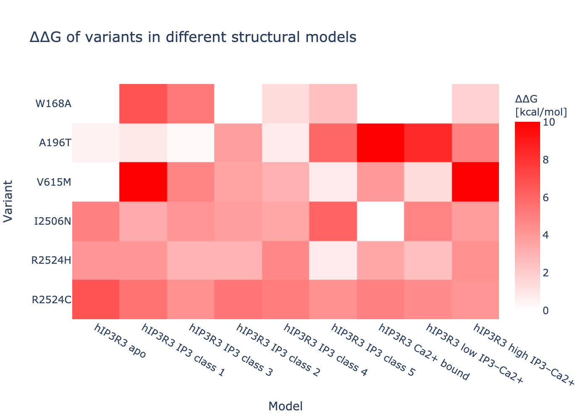

# ITPR3_analysis
In silico analyses of ITPR3 variants.
This is the support data for a [Michelanglo page](https://michelanglo.sgc.ox.ac.uk/) —page yet to be released.

## Models

Inositol 1,4,5-trisphosphate receptor type 3 ([Uniprot: Q14573](https://www.uniprot.org/uniprot/Q14573))
is a calcium channel activated by inositol 1,4,5-trisphosphate.

In [Paknejad & Hite, 2018](https://www.nature.com/articles/s41594-018-0089-6), a variety of structures were solved
by cryoEM in various states. 

|    | name                 | emd      | pdb   |  Zn   |  I3P  |  Ca   |
|---:|:---------------------|:---------|:------|:------|:------|:------|
|  0 | hIP3R3 apo           | EMD-7978 | 6DQJ  | 1     |  0    | 0     |
|  1 | hIP3R3 IP3 class 1   | EMD-7981 | 6DQN  | 1     |  1    | 0     |
|  2 | hIP3R3 IP3 class 2   | EMD-7984 | 6DQV  | 1     |  1    | 0     | 
|  3 | hIP3R3 IP3 class 3   | EMD-7983 | 6DQS  | 1     |  1    | 0     |
|  4 | hIP3R3 IP3 class 4   | EMD-7986 | 6DQZ  | 1     |  1    | 0     |
|  5 | hIP3R3 IP3 class 5   | EMD-7987 | 6DR0  | 1     |  1    | 0     |
|  6 | hIP3R3 Ca2+ bound    | EMD-7988 | 6DR2  | 1     |  0    | 2     |
|  7 | hIP3R3 low IP3–Ca2+  | EMD-7991 | 6DRA  | 1     |  0    | 2     |
|  8 | hIP3R3 high IP3–Ca2+ | EMD-7994 | 6DRC  | 1     |  1    | 2     |

These were used for scoring.

Do note that the models exceed 99,999 atoms making the PDB format problematic.
As a consequence the minimised models are present in the [folder structures](structures) as
both `pdb` and `mmtf`.

## Calculations

Pyrosetta was used.
Base script are in [my pyrosetta_scripts repo](https://github.com/matteoferla/pyrosetta_scripts).
Code used is in [code notes](code.md).

Each of the structures was minimised and the mutations scored.

Namely, the structures were minimised using local relax against the density map.
A final 5 cycles of dihedral Relax per chain was initially considered by not done (5 CPU days)
instead a 12 Å neighbourhood thorough minimisation was done for each variant.

A side investigation was done to see if the pocket formed by 2527, 2524 and 2357 could bind an organophosphate
(e.g. phospholipid). The pocket can indeed favourably accomodate an organophosphate (ethylphosphate as a proxy),
with a ∆∆G_binding of –17 kcal/mol, resulting from the following contributions:

| Residue | Chain | Score |
|--------:|--------:|---------:|
| ethylphosphate | Z | -8.6 | 
| K2527 | A |         -3.2 | 
| R2524 | A |     -1.7 | 
| F2520 | A |   -1.1 | 
| N2357 | A |    -1.0 | 

