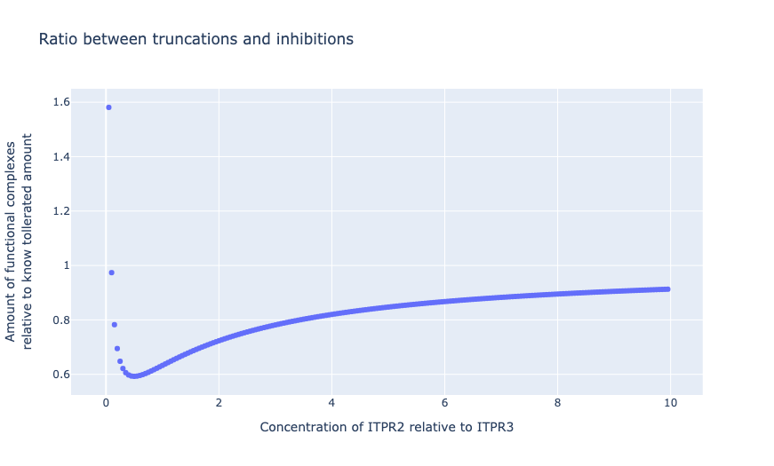
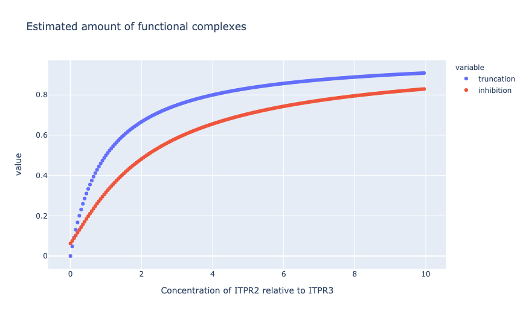

## Heterotetrameric inhibition

How much worse is the case of 
1 mutant chain in a single complex result in no activity (worst case scenario)
than the case of no ITPR3 complexes, assuming that
ITPR2 can rescue ITPR3 fine,
the ratio of ITPR2 to 3 varies in tissues and
N of Heterotetramers is linearly proportional to their ratio.

```python
import numpy as np
from scipy.stats import binom
import pandas as pd
import plotly.express as px
# ------------------------------------------------------------
ratios = np.arange(0.0, 10,0.05)  # how many type twos for every single three.
trunc = ratios / (ratios + 1)
# frequency of getting mutant is 1 in 2 alleles for homo, but 1 in 2*(1+r) het
inhibit = np.vectorize(lambda r: binom.pmf(0, 4, 1/(2 + 2 * r)))(ratios)
# ------------------------------------------------------------
df = pd.DataFrame({'ratio': ratios, 'truncation': trunc, 'inhibition': inhibit})
fig = px.scatter(df, x='ratio', y=['truncation','inhibition'],
                   title='Estimated amount of functional complexes')
fig.update_layout(xaxis=dict(title='Concentration of ITPR2 relative to ITPR3'))

fig.show()
# ------------------------------------------------------------
df['division'] = inhibit/trunc
fig = px.scatter(df, x='ratio', y='division',
                   title='Ratio between truncations and inhibitions')
fig.update_layout(xaxis=dict(title='Concentration of ITPR2 relative to ITPR3'),
                 yaxis=dict(title='Amount of functional complexes<br>relative to know tollerated amount'))

fig.show()
```

