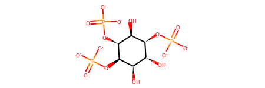
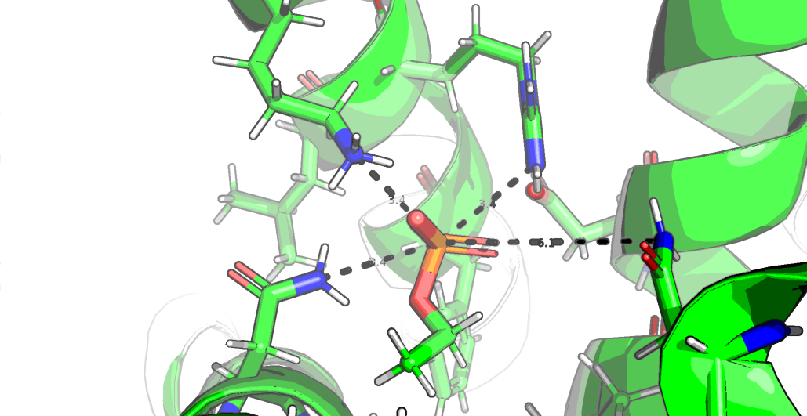

## Shortcuts

Several methods are from my helper module,`pyrosetta_help`, which is pip released (`pip install pyrosetta-help`) and
 can be found in its GitHub repo (https://github.com/matteoferla/pyrosetta_scripts).

## Downloads

IDs from Paknejad & Hite, 2018

```python
raw = 'hIP3R3 apo (EMD-7978, PDB 6DQJ)	hIP3R3 IP3 class 1 (EMD-7981, PDB 6DQN)	hIP3R3 IP3 class 2 (EMD-7984, PDB 6DQV)	hIP3R3 IP3 class 3 (EMD-7983, PDB 6DQS)	hIP3R3 IP3 class 4 (EMD-7986, PDB 6DQZ)	hIP3R3 IP3 class 5 (EMD-7987, PDB 6DR0)	hIP3R3 Ca2+ bound (EMD-7988, PDB 6DR2)	hIP3R3 low IP3–Ca2+ (EMD-7991, PDB 6DRA)	hIP3R3 high IP3–Ca2+ (EMD-7994, PDB 6DRC)'

import re
import pandas as pd

models = [dict(name = re.match('(.*)\(', entry).group(1),
               emd = re.search('(EMD-\d+)', entry).group(1),
               pdb = re.search('PDB (\w{4})', entry).group(1),
              ) for entry in raw.split('\t')]
model_table = pd.DataFrame(models)
```

|    | name                 | emd      | pdb   |
|---:|:---------------------|:---------|:------|
|  0 | hIP3R3 apo           | EMD-7978 | 6DQJ  | 
|  1 | hIP3R3 IP3 class 1   | EMD-7981 | 6DQN  |
|  2 | hIP3R3 IP3 class 2   | EMD-7984 | 6DQV  |
|  3 | hIP3R3 IP3 class 3   | EMD-7983 | 6DQS  |
|  4 | hIP3R3 IP3 class 4   | EMD-7986 | 6DQZ  |
|  5 | hIP3R3 IP3 class 5   | EMD-7987 | 6DR0  |
|  6 | hIP3R3 Ca2+ bound    | EMD-7988 | 6DR2  |
|  7 | hIP3R3 low IP3–Ca2+  | EMD-7991 | 6DRA  |
|  8 | hIP3R3 high IP3–Ca2+ | EMD-7994 | 6DRC  |

Data retrieval: EM map, cif and OMP aligned.

```python
from pyrosetta_help.common_ops import download_map
from pyrosetta_help.common_ops import download_opm
from pyrosetta_help.common_ops import download_cif # could have used PyMOL fetch

model_table.pdb.apply(download_map)
model_table.pdb.apply(download_opm)
model_table.pdb.apply(download_cif)
```
            
## Any ligands?

```python
import pymol2
    
for i, row in model_table.iterrows():
    pdb_filename = row.pdb+'.cif'
    with pymol2.PyMOL() as pymol:
        pymol.cmd.load(pdb_filename, 'model')
        ligands = {atom.resn for atom in pymol.cmd.get_model('not polymer').atom}
        print(ligands)
```
            
Gives 'ZN', 'I3P' and 'CA'.

Smiles from PDB needs correcting as I3P is deffo not neutral

```python
from rdkit import Chem
#Chem.MolFromSmiles('O[C@@H]1[C@H](O)[C@@H](O[P](O)(O)=O)[C@H](O[P](O)(O)=O)[C@@H](O)[C@@H]1O[P](O)(O)=O')
smiles = 'O[C@@H]1[C@H](O)[C@@H](O[P]([O-])([O-])=O)[C@H](O[P]([O-])([O-])=O)[C@@H](O)[C@@H]1O[P]([O-])([O-])=O'
mol = Chem.MolFromSmiles(smiles)
```
    


```python
from rdkit_to_params import Params
    
with pymol2.PyMOL() as pymol:
    pymol.cmd.load(pdb_filename, 'model')
    pymol.cmd.remove('not resn I3P')
    resi = {atom.resi for atom in pymol.cmd.get_model('not polymer').atom}
    assert len(resi) == 1
    pymol.cmd.save('I3P.pdb')
    
params = Params.from_smiles_w_pdbfile(pdb_file='I3P.pdb',
                                        smiles=smiles,
                                        name='I3P',
                                        proximityBonding=True)
params.dump('I3P.params')
```

Checking it is okay:

```python
import nglview

view = nglview.show_rosetta(params.test())
view.add_representation('hyperball', '*')
view 
```
     
## Minimise

Regular boilerplate 

```python
import pyrosetta
from pyrosetta_help.init_ops import make_option_string, configure_logger

logger = configure_logger()
extra_options= make_option_string(no_optH=False,
                                  ex1=None,
                                  ex2=None,
                                  #mute='all',
                                  ignore_unrecognized_res=False, # raise error!
                                  load_PDB_components=False,
                                  ignore_waters=False)
pyrosetta.init(extra_options=extra_options)
```
    
Some functions imported, minimisation.

```python
from typing import *
from pyrosetta_help.common_ops import (get_local_scorefxn, 
                                        pose_from_file, 
                                        prep_ED, 
                                        do_local_relax, get_local_relax,
                                        do_chainwise_relax)
for i, row in model_table.iloc[::-1].iterrows():
        header(row.pdb)
        # ------- files -------------- 
        pdb_filename = row.pdb+'.cif'
        local_filename = f'{row.pdb}.local.pdb'
        map_filename = row.emd+'.map'
        # ------- scorefxns -------------- 
        scorefxn_local = get_local_scorefxn()
        scorefxn = pyrosetta.get_fa_scorefxn()
        elec_dens_fast = pyrosetta.rosetta.core.scoring.ScoreType.elec_dens_fast
        scorefxn.set_weight(elec_dens_fast, 30)
        # --------- Load ------------------
        if os.path.exists(local_filename):
            print('Local already done.')
            pose = pose_from_file(local_filename, params_filenames=['I3P.params'])
        else:
            pose = pose_from_file(pdb_filename, params_filenames=['I3P.params'])
        ED = prep_ED(pose, map_filename)
        # --------- Local ------------------
        if not os.path.exists(local_filename):
            do_local_relax(pose, scorefxn_local)
            print(scorefxn_local(pose), 
                  scorefxn(pose), 
                  rmsd.calculate(pose), 
                  ED.matchPose(pose), 
                  flush=True)
            pose.dump_scored_pdb(local_filename, scorefxn_local)
        # ------- Regular ------------------
        # relax = pyrosetta.rosetta.protocols.relax.FastRelax(scorefxn, 5)
        # relax.apply(pose)
        # ------- Per Chain ------------------
        do_chainwise_relax(pose, scorefxn, 5)
        pose.dump_scored_pdb(f'{pdb_name}.lrc.pdb', scorefxn)
        print(scorefxn_local(pose), 
                  scorefxn(pose), 
                  rmsd.calculate(pose), 
                  ED.matchPose(pose), 
                  flush=True)
```
                  
Due to the problem of size, membrane was not activated.

Note that the size of the PDB files exceeds the 99_999 atom limit.

## Scoring

```python
from pyrosetta_help.score_mutants import MutantScorer

scoresx = []

for pdb in model_table.pdb:
    model = MutantScorer.from_file(modelname=pdb,
                                   filename=f'{pdb}.local.pdb',
                                   params_filenames=['I3P.params'])
    model.scorefxn = pyrosetta.create_score_function('ref2015')
    model.strict_about_starting_residue = True
    data = model.score_mutations(variants,
                                chain='A',
                                interfaces=(),
                                preminimise=True,
                                distance=12,
                                cycles=5)
    scoresx.append(pd.DataFrame(data))

scores = pd.concat(scoresx)

scores.to_csv('scores.csv')
```
    
## Plot

long to wide:

```python
wide = pd.DataFrame(scores, columns=['model','mutation','complex_ddG'])\
              .pivot(index='model', columns='mutation', values='complex_ddG')\
              .round(1)
```
                      
heatmap
                      
```python
import plotly.graph_objects as go

names = dict(zip(model_table.pdb, model_table.name.apply(lambda x: x.strip())))

fig = go.Figure(data=go.Heatmap(
                                y=wide.columns,
                                x=wide.index.to_series().apply(lambda x: names[x]),
                                z=wide.values.transpose(),
                                colorscale = [(0,"white"),(0.2,"white"), (1,"red")],
                                zmin=0, zmax=10,
                                colorbar = {'title': {'text': '∆∆G<br>[kcal/mol]'}}
                                ),
               layout=dict(title = {'text': '∆∆G of variants in different structural models'},
               yaxis = {'title': {'text': 'Variant'}},
               xaxis = {'title': {'text': 'Model'}},
               
            ))
fig.show()
```
    
## Membrane-insertion

```python
import pymol2, os

    for code in codes:
        if os.path.exists(f'{code}.lrc.pdb'):
            target = f'{code}.lrc.pdb'
        else:
            target = f'{code}.local.pdb'
        with pymol2.PyMOL() as pymol:
            pymol.cmd.load(f'{code}_OMP.pdb', 'OMP')
            pymol.cmd.load(target, 'target')
            pymol.cmd.align('target', 'OMP')
            pymol.cmd.save(f'{code}.local.mem.pdb', 'target or resn DUM')
```
            
## Phosphate

To test whether the pocket close to the R2524 binds an organophosphate, ethylphosphate was docked.

First the ligand was made
```python
from rdkit_to_params import Params

params = Params.from_smiles('CCOP(=O)([O-])[O-]', name='EPO')
import pyrosetta
pyrosetta.init()
params.test().dump_pdb('ethylphosphate.pdb')
params.dump('ethylphosphate.params')
params.mol   # display rdkit.Chem.Mol in Jupyter
```
Then it was placed with PyMOL.
Then it was hi-res docked
```python
pyrosetta.rosetta.protocols.docking.setup_foldtree(pose, 'ABCD_Z', pyrosetta.Vector1([1]))
scorefxn = pyrosetta.create_score_function('ligand')
docking = pyrosetta.rosetta.protocols.docking.DockMCMProtocol()
docking.set_scorefxn(scorefxn)
docking.apply(pose)
```
Contrained?
```python
# blank previous constraints
pyrosetta.rosetta.core.scoring.constraints.remove_constraints_of_type(pose, "atom_pair_constraint")
# add anew constraints
# https://www.rosettacommons.org/node/10951
def get_AtomID(chain:str, resi:int, atomname:str) -> pyrosetta.rosetta.core.id.AtomID:
    r = pose.pdb_info().pdb2pose(res=int(resi), chain=chain)
    assert r != 0, f'{resi}:{chain} is absent'
    residue = pose.residue(r)
    return pyrosetta.rosetta.core.id.AtomID(atomno_in=residue.atom_index(atomname), rsd_in=r)

HarmonicFunc = pyrosetta.rosetta.core.scoring.func.HarmonicFunc
cons = []
AtomPairConstraint = pyrosetta.rosetta.core.scoring.constraints.AtomPairConstraint

import re
for atom in ('2527.NZ', '2524.NH2', '2357.ND2'): # '2365.ND2'
    resi, atomname = re.match('(\d+)\.(\w+)', atom).groups()
    cons.append( AtomPairConstraint(get_AtomID('A', int(resi), atomname),
                get_AtomID('Z', 1, 'P1'),
                HarmonicFunc(x0_in=3.4, sd_in=0.2))
               )

cl = pyrosetta.rosetta.utility.vector1_std_shared_ptr_const_core_scoring_constraints_Constraint_t()
cl.extend(cons)

cs = pyrosetta.rosetta.core.scoring.constraints.ConstraintSet()
cs.add_constraints(cl)

setup = pyrosetta.rosetta.protocols.constraint_movers.ConstraintSetMover()
setup.constraint_set(cs)
setup.apply(pose)
```

The constraints are not needed for ('2527.NZ', '2524.NH2', '2357.ND2').
Whereas '2365.ND2' is close, it breaks the model if it is brought closer, so is ignored.

EDIT: this is because it should be `2365:D.ND2` not `2365:A.ND2`!

Consequently the constraints are not needed:
```python
# relax
movemap = pyrosetta.MoveMap()
epo_sele = pyrosetta.rosetta.core.select.residue_selector.ResidueNameSelector('EPO')
NeighborhoodResidueSelector = pyrosetta.rosetta.core.select.residue_selector.NeighborhoodResidueSelector
neigh_sele = NeighborhoodResidueSelector(epo_sele, distance=10, include_focus_in_subset=True)
movemap.set_bb(allow_bb=epo_sele.apply(pose))
movemap.set_chi(allow_chi=neigh_sele.apply(pose))
movemap.set_jump(True)
scorefxn = pyrosetta.get_fa_scorefxn()
stm = pyrosetta.rosetta.core.scoring.ScoreTypeManager()
scorefxn.set_weight(stm.score_type_from_name("atom_pair_constraint"), 10)
relax = pyrosetta.rosetta.protocols.relax.FastRelax(scorefxn, 15)
relax.set_movemap_disables_packing_of_fixed_chi_positions(True)
relax.set_movemap(movemap)
relax.apply(pose)

# see how the constraints faired
for con in cl:
    print(con.score(pose) * scorefxn.get_weight(stm.score_type_from_name("atom_pair_constraint")))

# save
pose.dump_pdb('EPO_relax.pdb')

# calculate ddG
split_pose = pyrosetta.Pose()
split_pose.assign(pose)
ResidueVector = pyrosetta.rosetta.core.select.residue_selector.ResidueVector
lig_pos = list(ResidueVector(epo_sele.apply(split_pose)))[0]
if pose.residue(lig_pos).connect_map_size() > 0:
    cys_pos = pose.residue(lig_pos).connect_map(1).resid()
    # RESCON: 305 LIG n-conn= 1 n-poly= 0 n-nonpoly= 1 conn# 1 22 145 3
    split_pose.conformation().sever_chemical_bond(seqpos1=cys_pos, res1_resconn_index=3, seqpos2=lig_pos,
                                                  res2_resconn_index=1)
xyz = pyrosetta.rosetta.numeric.xyzVector_double_t()
xyz.x = 1000.0
xyz.y = 0.0
xyz.z = 0.0
for a in range(1, split_pose.residue(lig_pos).natoms() + 1):
    split_pose.residue(lig_pos).set_xyz(a, split_pose.residue(lig_pos).xyz(a) + xyz)
    
print(scorefxn(pose) - scorefxn(split_pose))
```
The ∆∆G score without contraints is -1.2 kcal/mol.
This score is not that fantastic, yet the position seems great.



Getting the inter-residue score contribution for each atom shows there is no atom that is causing issues.
```python
score_types = ['lj_atr', 'lj_rep', 'fa_solv', 'fa_elec']
scorefxn(pose)
residue = pose.residue(epo_idx)
scores = {residue.atom_name(i): {st: 0 for st in score_types} for i in range(1, residue.natoms() + 1)}
# Iterate per target residue's atom per all other residues' atoms
for i in range(1, residue.natoms() + 1):
    iname = residue.atom_name(i)
    for r in range(1, pose.total_residue() + 1):
        other = pose.residue(r)
        for o in range(1, other.natoms() + 1):
            score = pyrosetta.toolbox.atom_pair_energy.etable_atom_pair_energies(residue,
                                                                                 i,
                                                                                 other,
                                                                                 o,
                                                                                 scorefxn)
            for st, s in zip(score_types, score):
                scores[iname][st] += s
pd.DataFrame(scores).transpose()
```

## Michelanglo

```python
from michelanglo_api import MikeAPI, MikePage

mike = MikeAPI('matteoferla', '******')
page = mike.get_page(uuid)
page.proteins[0]['value'] = '6DRC'
page.proteins[0]['type'] = 'rcsb'
page.proteins[0]['isVariable'] = False

page.proteins[0]['chain_definitions'] = [{'chain': chain,
                                          'uniprot': 'Q14573',
                                          'x': 5,
                                          'y': 2611,
                                          'offset': 0,
                                          'range': '5-2611',
                                          'name': 'ITPR3',
                                          'description': None} for chain in 'ABCD']
page.data_other = ' '.join(['class="prolink"',
                            'data-target="viewport"',
                            'data-focus="domain"',
                            'data-view="[71.5,-62.1,-269.4,0,276.2,3.1,72.6,0,-12.8,-278.7,60.9,0,-209.4,-209.2,-223.9,1]"',
                            'data-hetero=true',
                            'data-selection=":A"',
                            'data-color="#b2d8d8"',
                            'data-selection-alt1=":B" data-focus-alt1="domain" data-color-alt1="#66b2b2"',
                            'data-selection-alt2=":C" data-focus-alt2="domain" data-color-alt2="#008080"',
                            'data-selection-alt3=":D" data-focus-alt3="domain" data-color-alt3="#004c4c"'])

page.append_github_entry(username='matteoferla',
                         repo='ITPR3_analysis',
                         path='structures/A196A.pdb')
page.proteins[-1]['name'] = 'A196A'
# etc.
```
Now for the cool part. Adding a membrane in Michelanglo every time a component is added:
```python
with open('oriented_membrane.pdb', 'r') as fh:
    page.loadfun = f'window.membrane = `{fh.read()}`;'
page.loadfun += '''
window.addMembrane = () => {
    const stage = NGL.getStage();
    const memblob = new Blob([window.membrane, {type: 'text/plain'}]);
    stage.loadFile(memblob, {ext: 'pdb', firstModelOnly: true})
         .then(o => o.addRepresentation('ball+stick'));
    };
    
window.addMembraneListener = () => {
    const stage = NGL.getStage();
    window.addMembrane();
    stage.signals.componentAdded.add(() => {
        if (stage.compList.length < 2) window.addMembrane();
    });}
    
setTimeout(addMembraneListener, 2000);
'''
```

Submit!
```python
page.clear_revisions()
page.commit()
```
Description

```python
with open('description.md', 'w') as fh:
    fh.write(page.description)
```
and
```python
with open('description.md', 'r') as fh:
    page.description = fh.read()
```